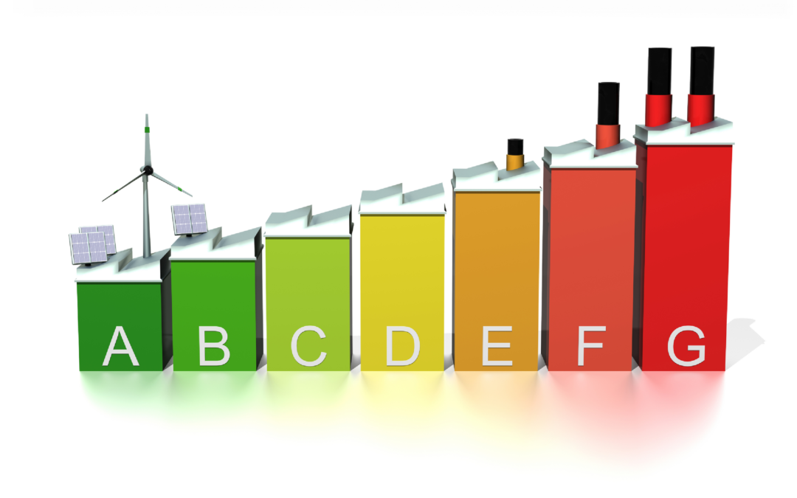
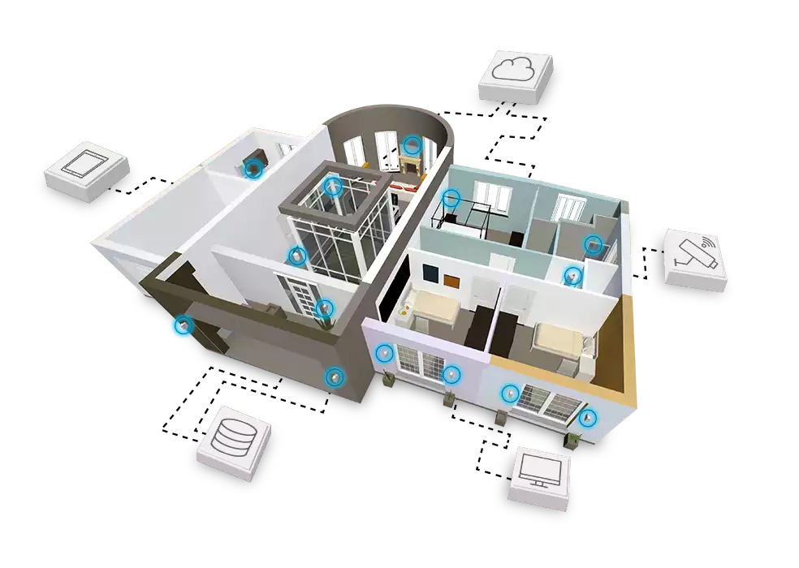

import imageLeslieAlexander from '@/images/spazi/MCX06307.jpg'

export const article = {
  date: '2024-03-01',
  title: 'La Manutenzione Preventiva che Fa Risparmiare: I Consigli di Climawell',
  description:
    'Scopri come una manutenzione regolare dei tuoi impianti termoidraulici può prolungarne la vita utile e ridurre i costi di gestione.',
  author: {
    name: 'Diletta Pontrelli',
    role: 'Specialista Tecnico',
    image: { src: imageLeslieAlexander },
  },
}

export const metadata = {
  title: article.title,
  description: article.description,
}

## 1. Perché la Manutenzione È Cruciale

Mantenere in ottime condizioni i tuoi impianti termoidraulici è fondamentale non solo per garantire prestazioni ottimali ma anche per evitare costi inutili. Una manutenzione regolare consente di identificare problemi nascosti, ridurre guasti improvvisi e migliorare l’efficienza energetica.

<TopTip>
  Affida la manutenzione dei tuoi impianti solo a professionisti qualificati: una verifica accurata oggi può evitare problemi gravi domani.
</TopTip>

## 2. Quando Fare la Manutenzione

<TagList>
  <TagListItem>Caldaie</TagListItem>
  <TagListItem>Sistemi di raffreddamento</TagListItem>
  <TagListItem>Pompe di calore</TagListItem>
</TagList>

La frequenza consigliata varia in base al tipo di impianto:

- **Caldaie**: Almeno una volta all’anno, idealmente prima della stagione invernale.
- **Sistemi di raffreddamento**: Controlli stagionali per garantire un funzionamento efficiente durante i mesi più caldi.
- **Pompe di calore**: Due controlli annuali, uno prima dell’inverno e uno in primavera, per verificarne il corretto funzionamento in entrambe le modalità.

## 3. Benefici della Manutenzione Preventiva

La manutenzione preventiva non solo prolunga la vita dei tuoi impianti, ma riduce anche gli sprechi energetici, contribuendo a un ambiente più sostenibile.

## 4. Il Supporto di Climawell

Climawell offre soluzioni personalizzate per la manutenzione degli impianti termoidraulici, garantendo efficienza, sicurezza e risparmio. I nostri tecnici specializzati ti aiuteranno a mantenere i tuoi sistemi sempre al massimo delle prestazioni.

<TopTip>
  Contattaci oggi stesso per prenotare una verifica del tuo impianto e scoprire i nostri piani di manutenzione personalizzati.
</TopTip>

