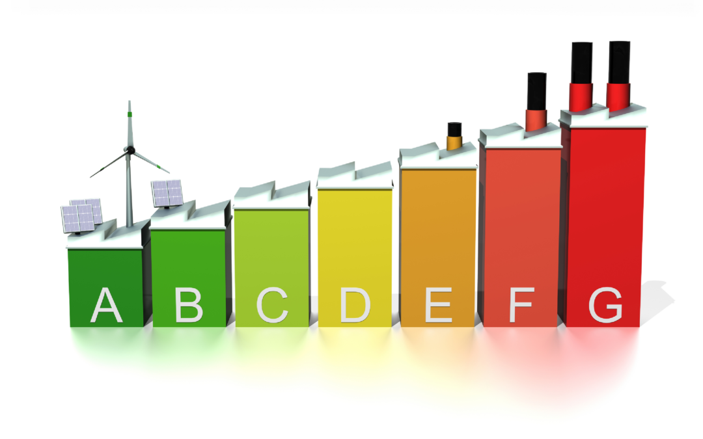
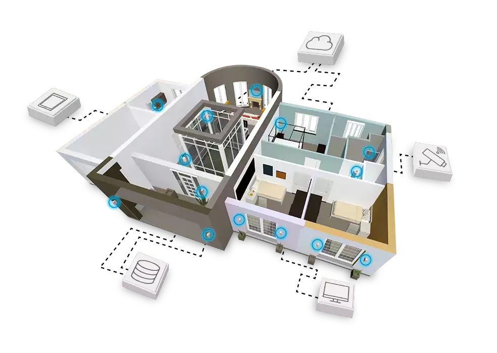
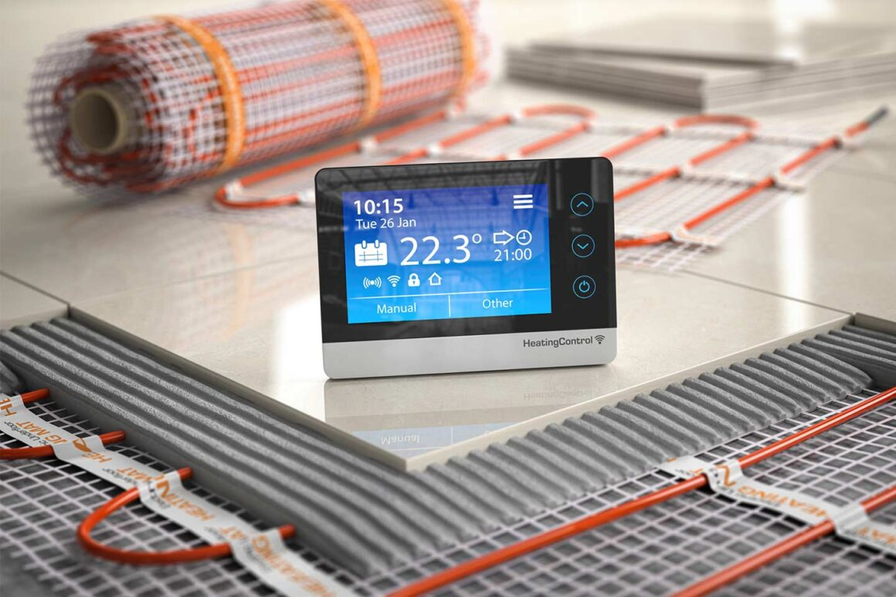

import imageAuthor from '@/images/spazi/MCX06307.jpg';

export const article = {
  date: '2024-12-18',
  title: 'Le Soluzioni Termoidrauliche del Futuro: Tendenze e Innovazioni per il 2024',
  description:
    'Esploriamo le tendenze e le tecnologie emergenti nel settore termoidraulico che rivoluzioneranno il modo in cui pensiamo al comfort e all’efficienza energetica.',
  author: {
    name: 'Diletta Pontrelli',
    role: 'Specialisa Tecnico',
    image: { src: imageAuthor },
  },
};

export const metadata = {
  title: article.title,
  description: article.description,
};

## 1. Efficienza Energetica: Una Necessità, Non un Lusso

Con l’aumento dei costi energetici e una crescente attenzione alla sostenibilità, l’efficienza energetica è diventata una priorità per famiglie e aziende. I nuovi sistemi termoidraulici integrano tecnologie avanzate come pompe di calore ibride e caldaie a condensazione che riducono il consumo energetico senza sacrificare il comfort.

Nel 2024, prevediamo una maggiore diffusione di soluzioni intelligenti che consentono il monitoraggio in tempo reale del consumo energetico. Queste tecnologie non solo migliorano la gestione del riscaldamento, ma educano anche i consumatori a un uso più responsabile delle risorse.

## 2. Smart Home e Integrazione con l’IoT

L'internet delle cose (IoT) sta trasformando il settore termoidraulico, portando funzionalità mai viste prima. Immagina un sistema di riscaldamento che si adatta automaticamente alle condizioni meteorologiche o un’app mobile che ti avvisa se c’è una perdita d’acqua.

Nel prossimo anno, le soluzioni termoidrauliche integrate con l’IoT diventeranno uno standard, non un’opzione. Prevediamo che prodotti come termostati intelligenti e rilevatori di perdite d’acqua a distanza guadagneranno sempre più popolarità, grazie alla loro capacità di prevenire problemi costosi e migliorare la qualità della vita.

## 3. Soluzioni Personalizzate per il Comfort Moderno

Ogni casa ha esigenze uniche, e il futuro del settore termoidraulico sta nell’offrire soluzioni su misura. Da impianti di riscaldamento radiante per ambienti moderni a sistemi di ventilazione per migliorare la qualità dell’aria, le possibilità sono infinite.

Nel 2024, ci aspettiamo che le aziende come Climawell si concentrino ancora di più su soluzioni modulari che possano essere personalizzate per soddisfare le esigenze specifiche di ogni cliente, combinando design, funzionalità e sostenibilità.

